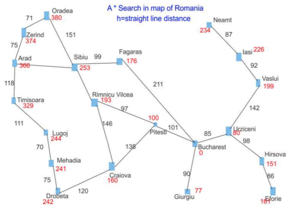
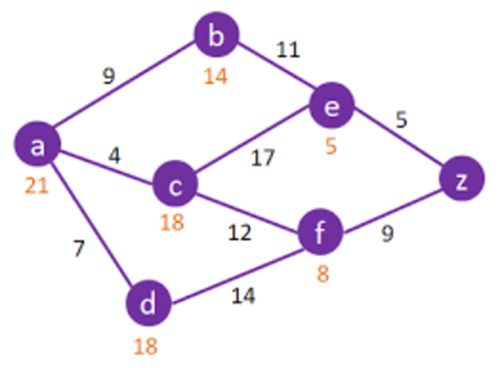
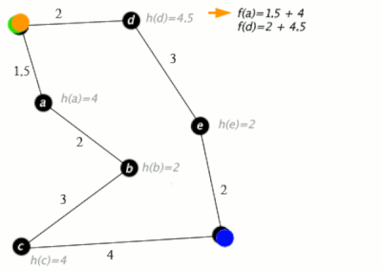
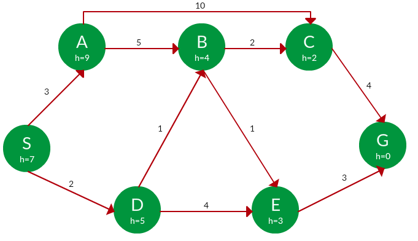

A* Search Algorithm
-------------------

### What is it?

* Finds the shortest path
  - originally a graph algorithm

### But can be used in grids as well

* Adjacent tiles replace graph child-nodes
  - since this batch are game experts, we'll practice A* on grids

#### Let's first study the algorithm on a graph

- it's an example of an informed search
- DFS and BFS are blind searches

#### Cost functions (1/5)

- Each node has two parameters for its _cost_ function
  + **g** measures travel distance to its adjacent node
  + **h** (heuristic function) estimates the distance to the goal

#### Cost functions (2/5)

- The two values help _"tie-break"_ one another
  + **g** in most cases, is not an estimate
  + **h** can simply be _"as-the-bird-flies"_ straight-line distance

#### Cost functions (3/5)

- **g** can break ties when heuristic estimate is tied
  + **c** and **d** are both 18 units from **z**
  + but shorter travel from **a** to **c**

#### Cost functions (4/5)

- **h** can break ties when actual distance is the same
  + very obvious in grids
    - distance from **x** to horizontal and vertical adjacents is 10
    - distance from **x** to diagonals is 14
    - we just use Pythagorean, `int`s easier to reason about, faster
    - $ \sqrt{10^2 + 10^2} \approx 14 $

<table style="border: 1px solid black; margin-top: 32px">
<tr style="border: 1px solid black">
  <td style="border: 1px solid black">
    14
  </td>
  <td style="border: 1px solid black">
    10
  </td>
  <td style="border: 1px solid black">
    14  
  </td>
</tr>
<tr style="border: 1px solid black">
  <td style="border: 1px solid black">
    10
  </td>
  <td style="border: 1px solid black; text-align: center; color: darkred">
    x
  </td>
  <td style="border: 1px solid black">
    10
  </td>
</tr>
<tr style="border: 1px solid black">
  <td style="border: 1px solid black">
    14
  </td>
  <td style="border: 1px solid black">
    10
  </td>
  <td style="border: 1px solid black">
    14
  </td>
</tr>
</table>

#### Cost functions (5/5)

- **h** can break ties when actual distance is the same
  + when the goal is to the right of **x**
    - the 3 adjacent cells to its left will have a larger **h**
    - the vertical cells above and below it will have a larger **h**
    - **50** vs. $ \sqrt{10^2 + 50^2} \approx 51 $

<table style="border: 1px solid black; margin-top: 32px">
<tr style="border: 1px solid black">
  <td style="border: 1px solid black">
    14
  </td>
  <td style="border: 1px solid black">
    10
  </td>
  <td style="border: 1px solid black">
    14
  </td>
  <td style="border: 1px solid black">
    &nbsp;&nbsp;
  </td>
  <td style="border: 1px solid black">
    &nbsp;&nbsp;
  </td>
  <td style="border: 1px solid black">
    &nbsp;&nbsp;
  </td>
  <td style="border: 1px solid black">
    &nbsp;&nbsp;
  </td>
</tr>
<tr style="border: 1px solid black">
  <td style="border: 1px solid black">
    10
  </td>
  <td style="border: 1px solid black; text-align: center; color: darkred">
    x
  </td>
  <td style="border: 1px solid black">
    10
  </td>
  <td style="border: 1px solid black">
    &nbsp;&nbsp;
  </td>
  <td style="border: 1px solid black">
    &nbsp;&nbsp;
  </td>
  <td style="border: 1px solid black">
    &nbsp;&nbsp;
  </td>
  <td style="border: 1px solid black; color: blue">
    G
  </td>
</tr>
<tr style="border: 1px solid black">
  <td style="border: 1px solid black">
    14
  </td>
  <td style="border: 1px solid black">
    10
  </td>
  <td style="border: 1px solid black">
    14
  </td>
  <td style="border: 1px solid black">
    &nbsp;&nbsp;
  </td>
  <td style="border: 1px solid black">
    &nbsp;&nbsp;
  </td>
  <td style="border: 1px solid black">
    &nbsp;&nbsp;
  </td>
  <td style="border: 1px solid black">
    &nbsp;&nbsp;
  </td>
</tr>
</table>

### Overview of A* on a graph

* Cost of each node is `f = g + h`

### A* Demo on Graph (1/6)

<pre>
Q = [A(9)]
</pre>

### A* Demo on Graph (2/6)

<pre>
Q = [AB(5+4), AC(10+2)]
Q = [AB(9),   AC(12)]
</pre>

### A* Demo on Graph (3/6)

<pre>
Q = [ABC(7+2), ABE(6+3), AC(12)]
Q = [ABC(9),   ABE(9),   AC(12)]
</pre>

### A* Demo on Graph (4/6)

<pre>
Q = [ABE(9), ABCG(11+0), AC(12)]
Q = [ABE(9), ABCG(11),   AC(12)]
</pre>

### A* Demo on Graph (5/6)

<pre>
Q = [ABEG(9+0), ABCG(11), AC(12)]
Q = [ABEG(9),   ABCG(11), AC(12)]
</pre>

### A* Demo on Graph (6/6)

<pre>
Q = [ABEG(9),   ABCG(11), AC(12)]
`Q.pop()` yields our goal, stop search
</pre>

## Demo for A* on a grid is on the video