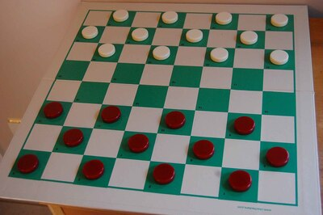

Intro to Machine Learning
-------------------------

<small>
  &lt;/&gt;
  <a href="https://github.com/psse-cpu/se3121-intro-to-ml-slides">
    https://github.com/psse-cpu/se3121-intro-to-ml-slides
  </a>
</small>

<h4 style="margin-top: 192px; font-size: 0.85em;">
  SE 3121
  Machine Learning
</h4>

  <b>Richard Michael Coo</b> |

  
  
  @myknbani

### Outline

- What is machine learning?
- brief history
- ML as the best way forward
- supervised vs. unsupervised learning
- two types of supervised learning
  * regression
  * classification
- example non-ML AI algorithms
  * A* pathfinding algo
  * minimax gameplaying algo

#### Machine Learning

  <blockquote>
    Field of study that gives computers the ability to learn without being explicitly programmed.  
    
      - Arthur Samuel (1959)
    
  </blockquote>
  
  

#### Arthur Samuel's Checkers Playing Program

- started with minimax algorithm
- also used $ \alpha-\beta $ pruning
  * limited memory during his time
- then allowed it to self learn

### Formal Definition

  <blockquote>
    A computer program is said to learn from experience E with respect to some task T
    and some performance measure P, if its performance on T, as measured by P, 
    <strong>improves with experience E.</strong>
     
    
      - Tom Mitchell (1998)
    
  </blockquote>
  
  

#### ML is the best way towards human-like AI

* Discuss on Canvas (or live class) the diff. between 
  - artificial intelligence and 
  - natural (human) intelligence
* e.g. the inhumanity of AIs in your favorite MOBA:
  - or other game genres?
  - improves over time?
    + doesn't fall for the same tricks again and again?
    + bots don't buy defuse kits even after several losing streaks
    + gets stuck in the small vent in CS:GO Mirage again and again
    + 👆 takes too long to unstuck as a team
  - very accurate chain-stuns?
  - very accurate moving, jumping headshots?

### Examples:

* learning from web browsing data, clicks, etc.
  - feel creepy about searches and ads being very smart?
* smart embedded systems / IoT
  - self-driving cars, self-piloting copters
  - janitor/slave robots
* five senses
  - computer vision
    * picture and face recognition
    * handwriting recognition, OCR
  - natural language processing
    * Siri/Cortana can understand (-ish) what you say
    * it can synthesize human-like speech to talk back to you

