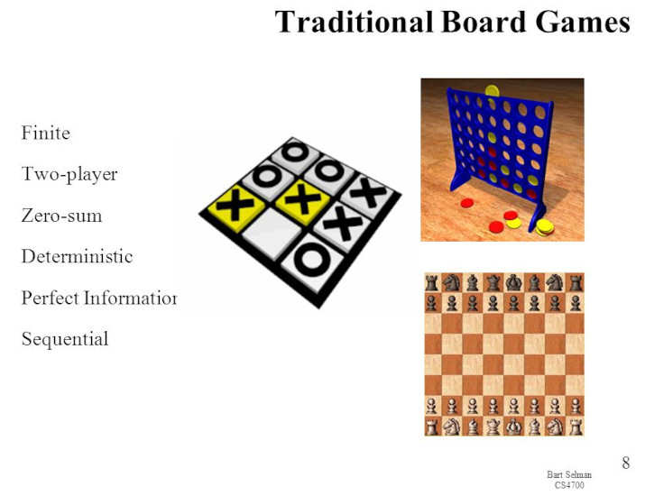
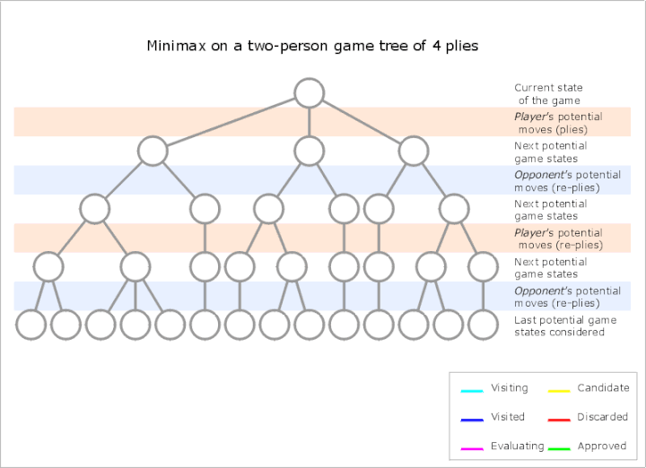
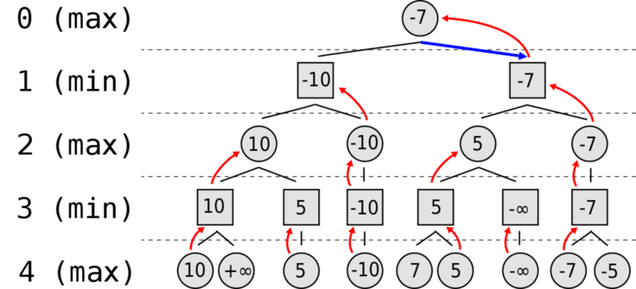
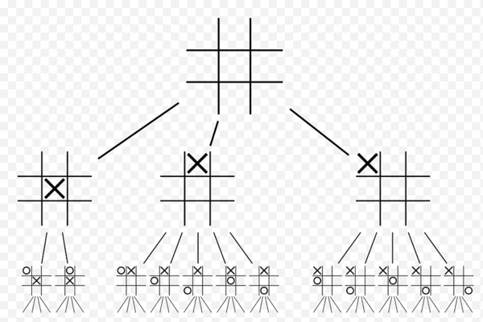
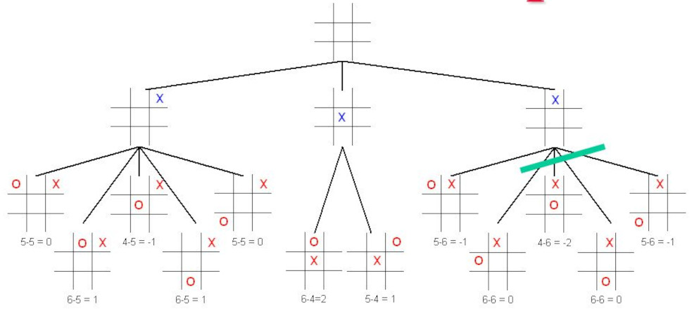
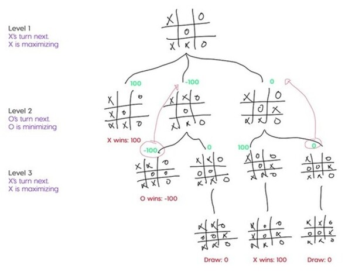

Non-learning Algorithm: Minimax
-------------------------------


### Minimax Algorithm

* Originally formulated for games that are:
  - two-player
  - zero-sum
    * total gains of particpants are added
    * total losses are subtracted
    * the end result is zero
  - deterministic
    * no randomness (dice, cards, etc.)
  - perfect information
    * no hidden information (face-down cards)
* ca be extended - more complex games, uncertainty


### The original target




### The general idea: Step 1

* From the current position, look at all possible moves $x$-plies deep
  - **ply**: means half-move, or turn
  - DeepBlue looked ahead at least 12 plies
    + DeepBlue is the IBM AI that beat former Chess champ Kasparov
    + in some situations it would go 40-plies deep
  - not feasible in complex games like chess to go too deep
    + Each position yields an average of 35 possible moves (branching factor $ b $ = 35)
    + An average game is 40 moves per player (depth $ d $ = 80)
    + Time complexity of $ O(b^d) $
  - tic-tac-toe can have AI look at the entire game!


### The general idea: Step 2 and 3

* Step 2: Evaluate each leaf node (final position)
  - using some heuristic function
    + remember in A*, a heuristic is a _"measure of goodness"_
  - in Tic-tac-toe, it might simply be:
    + number of possible X wins - number of possible O wins
  - in chess, it's more complicated
    + material weight * material score +
    + king safety weight * king safety score +
    + mobility weight * mobility score....etc.
  - score AI win as $+\infty$, human win as $-\infty$
* Step 3:  apply minimax algo to game tree
  


### Long GIF ahead...




### Squares are _min_, circles are _max_

* Computer will choose the root's child that:
  - leads to **"maximum"** winning chances
  - it also assumes human plays the best moves




### Tic-tac-toe 3-ply from the starting position

* Incomplete expansion (8 branches can't fit in pic)




### Leaf nodes scoring

- heuristic fn: $ xPossibleWins - oPossibleWins $
  + or $ +\infty $ and $ -\infty $ for wins and losses




### Expanding on the 7th-move

* Can also use a large number instead of $ \infty $




### Depth-limited minimax algo

* This function returns the score of the best move
  - not the best _"move"_ itself, but you're almost there

```coffee [1-13 | 15-16]
function minimax(node, depth, maximizingPlayer) is
  if depth == 0 or node is a terminal node then
    return the heuristic value of node
  if maximizingPlayer then
    value = −∞
    for each child of node do
      value = max(value, minimax(child, depth − 1, FALSE))
    return value
  else # minimizing player
    value = +∞
    for each child of node do
      value = min(value, minimax(child, depth − 1, TRUE))
    return value

# Initial call
minimax(origin, depth, TRUE)
```


### Demo for tic-tac-toe is on lecture videotxt