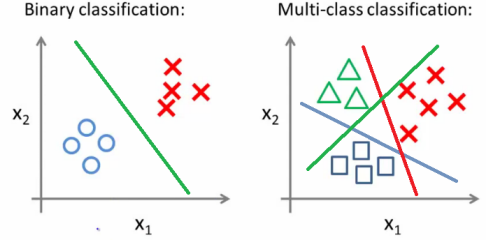

Two Broad Types of ML
---------------------

### Breakdown 

* Two main types:
  - supervised learning and unsupervised learning

### Two Types of Machine Learning (1/7)

* supervised learning
  - learns from labelled training data
  - humans _"supervise"_ (teach) it first
  - example #1: spam classification
    * you (and millions of Gmail users) mark messages as spam
    * over time, Google's search engine knows how to do it
    * if it makes a mistake, mark **Not Spam** and it learns more
    * by marking **spam** or **not spam**, you are teaching the AI
  - example #2: tagging photos
    * you (and your friends) tag you in a groupie
    * you upload your selfie as a profile pic
    * eventually FB can recognize your face, and autotag (or suggest)

### Two Types of Machine Learning (2/7)

* Back to definition
  - A computer program is said to learn from experience E with respect to some 
    task T and some performance measure P, if its performance on T, as measured by P, 
    **improves with experience E.**
  - spam classification, what is E, T, and P?
    + T = classifying emails as spam or not spam
    + E = watching you flag emails as spam or not spam
    + P = the number (or percentage) of emails correctly labelled by the machine as spam or not spam
  - photo tagging, what is E, T, and P?
  - self-driving car, what is E, T, and P?

### Two Types of Machine Learning (3/7)

* unsupervised learning: no labels!!

### Two Types of Machine Learning (4/7)

* unsupervised learning
  - learn from a random, chaotic set of data
  - find out how they're related, grouped, etc.

### Two Types of Machine Learning (5/7)

* unsupervised learning
  - customer/market segmentation

### Two Types of Machine Learning (6/7)

* unsupervised learning
  - customer/market segmentation

### Two Types of Machine Learning (7/7)

* unsupervised learning
  - social network segmentation (group member suggestions)

#### Two Types of Supervised Learning (1/5)

* Regression
  - outputs a value from a continuous range (a number)
    + housing price prediction
    + number of passers for SE-3121 prediction

#### Two Types of Supervised Learning (2/5)

* Classification
  - outputs a value from discrete classes
    + benign or malignant tumor based on tumor size and age
    + sentiment analysis (positve or negative comment)
    + what dog breed is in the picture?  (multi-class)

#### Two Types of Supervised Learning (3/5)

* Classification
  - binary: classify as one of two classes
  - multiclass: classify as one of many classes
    + can be converted into binary classification (Beagle vs not Beagle)
    + or get the maximum probability that it's a German shepherd
    + 3.2% Golden Retriever, 88.9% German Shepherd, 0.33% Beagle

#### Two Types of Supervised Learning (4/5)

* Classification
  - the dogs from OOP is back!

#### Two Types of Supervised Learning (5/5)

* Robots clean up after learning how humans do it

<iframe width="840" height="480" src="https://www.youtube.com/embed/ZIA4ih_8hfA" frameborder="0" allow="accelerometer; autoplay; encrypted-media; gyroscope; picture-in-picture" allowfullscreen></iframe>